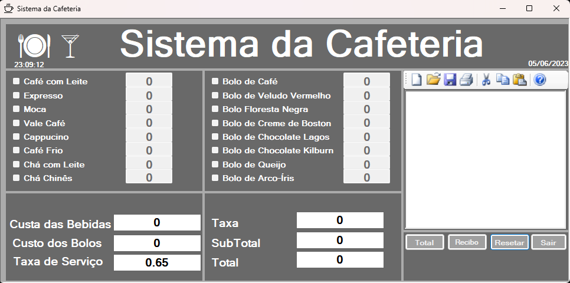
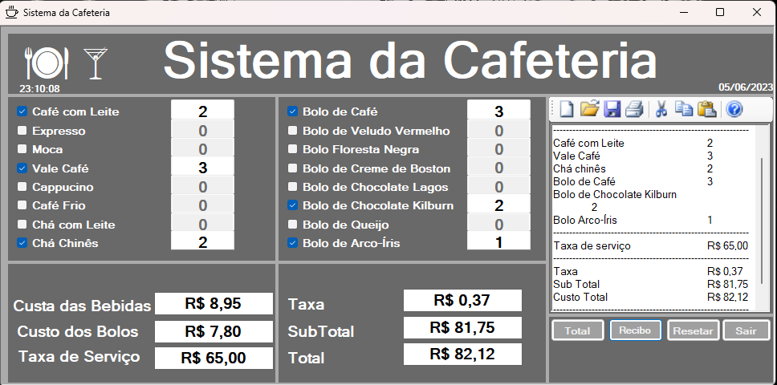
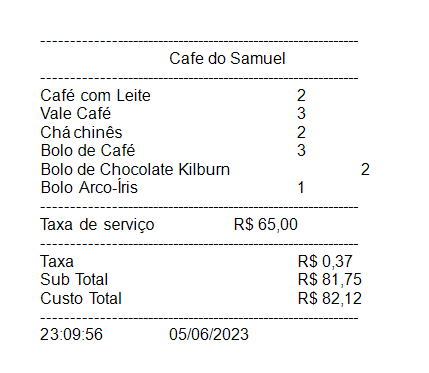
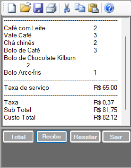

# Coffee-Shop
<h1 align="center"> Projeto Cafeteria </h1>

## :memo: Descrição
* Uma simulação de uma cafeteria, a onde você mesmo pode montar o seu pedido e simular a sua compra ou simular que seja um atendente de uma bela cafeteria.

## :books: Funcionalidades
* Você pode montar o seu pedido
* Remover os pedidos feitos
* Simular compra para ver o valor
* se auto atender ou fingir ser um atendente de loja
* e se divertir com as custas desse pequeno projeto

* ## :wrench: Tecnologias utilizadas

  

## 📸 Fotos do projeto

